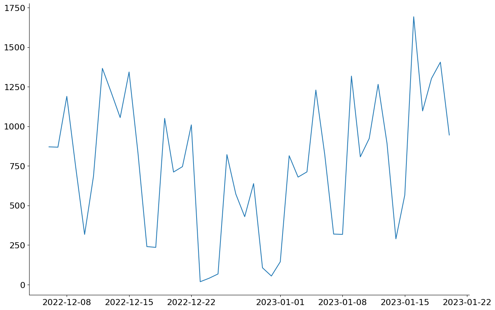
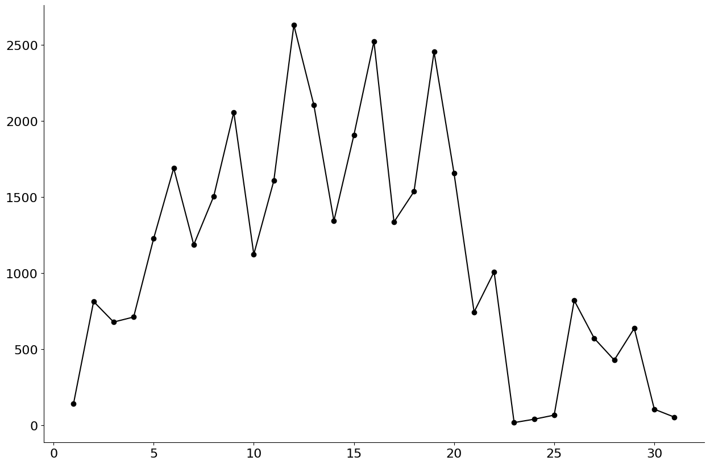
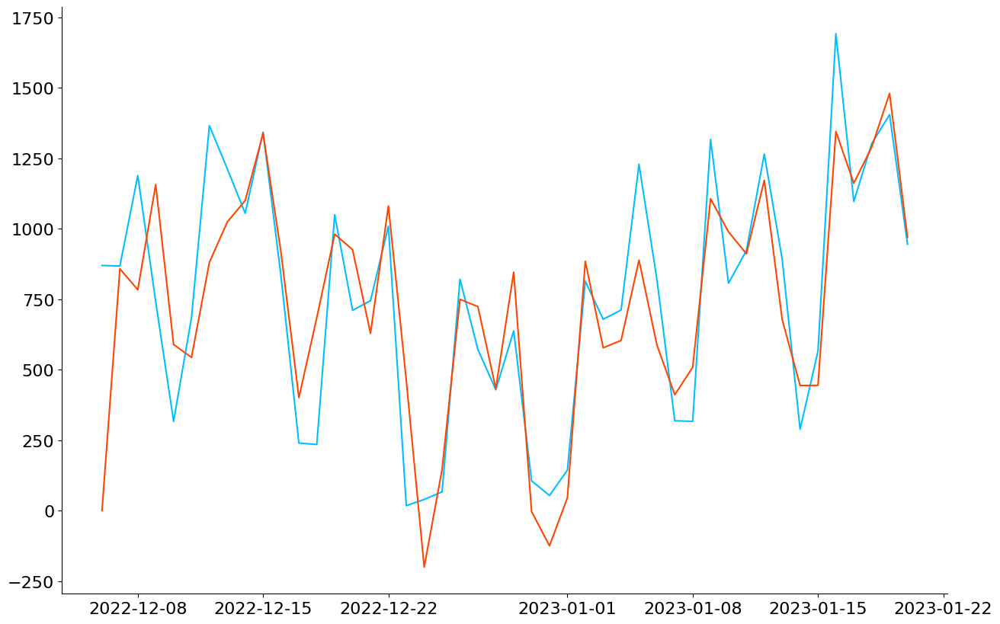
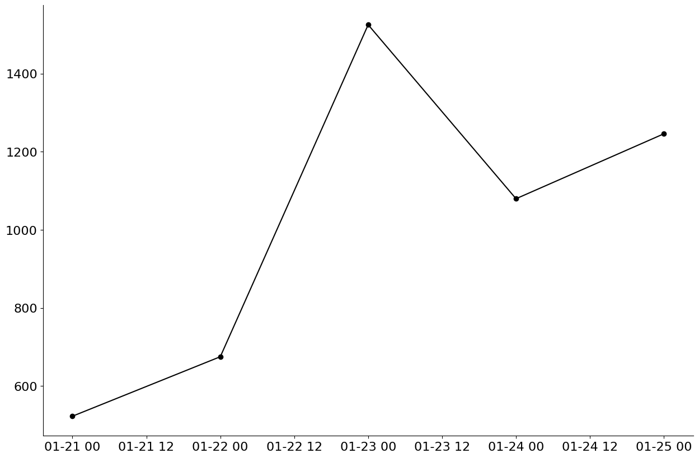

```python
pip install pandas
```

    Requirement already satisfied: pandas in c:\users\administrator\appdata\local\programs\python\python311\lib\site-packages (1.5.3)
    Requirement already satisfied: python-dateutil>=2.8.1 in c:\users\administrator\appdata\local\programs\python\python311\lib\site-packages (from pandas) (2.8.2)
    Requirement already satisfied: pytz>=2020.1 in c:\users\administrator\appdata\local\programs\python\python311\lib\site-packages (from pandas) (2022.6)
    Requirement already satisfied: numpy>=1.21.0 in c:\users\administrator\appdata\local\programs\python\python311\lib\site-packages (from pandas) (1.24.1)
    Requirement already satisfied: six>=1.5 in c:\users\administrator\appdata\local\programs\python\python311\lib\site-packages (from python-dateutil>=2.8.1->pandas) (1.16.0)
    Note: you may need to restart the kernel to use updated packages.
    

    
    [notice] A new release of pip available: 22.3 -> 22.3.1
    [notice] To update, run: python.exe -m pip install --upgrade pip
    


```python
pip install numpy
```

    Requirement already satisfied: numpy in c:\users\administrator\appdata\local\programs\python\python311\lib\site-packages (1.24.1)
    Note: you may need to restart the kernel to use updated packages.
    

    
    [notice] A new release of pip available: 22.3 -> 22.3.1
    [notice] To update, run: python.exe -m pip install --upgrade pip
    


```python
pip install warnings
```

    Note: you may need to restart the kernel to use updated packages.
    

    ERROR: Could not find a version that satisfies the requirement warnings (from versions: none)
    ERROR: No matching distribution found for warnings
    
    [notice] A new release of pip available: 22.3 -> 22.3.1
    [notice] To update, run: python.exe -m pip install --upgrade pip
    


```python
pip install matplotlib
```

    Collecting matplotlib
      Using cached matplotlib-3.6.3-cp311-cp311-win_amd64.whl (7.2 MB)
    Collecting contourpy>=1.0.1
      Using cached contourpy-1.0.7-cp311-cp311-win_amd64.whl (162 kB)
    Collecting cycler>=0.10
      Using cached cycler-0.11.0-py3-none-any.whl (6.4 kB)
    Collecting fonttools>=4.22.0
      Using cached fonttools-4.38.0-py3-none-any.whl (965 kB)
    Collecting kiwisolver>=1.0.1
      Using cached kiwisolver-1.4.4-cp311-cp311-win_amd64.whl (55 kB)
    Requirement already satisfied: numpy>=1.19 in c:\users\administrator\appdata\local\programs\python\python311\lib\site-packages (from matplotlib) (1.24.1)
    Requirement already satisfied: packaging>=20.0 in c:\users\administrator\appdata\local\programs\python\python311\lib\site-packages (from matplotlib) (23.0)
    Collecting pillow>=6.2.0
      Using cached Pillow-9.4.0-cp311-cp311-win_amd64.whl (2.5 MB)
    Collecting pyparsing>=2.2.1
      Using cached pyparsing-3.0.9-py3-none-any.whl (98 kB)
    Requirement already satisfied: python-dateutil>=2.7 in c:\users\administrator\appdata\local\programs\python\python311\lib\site-packages (from matplotlib) (2.8.2)
    Requirement already satisfied: six>=1.5 in c:\users\administrator\appdata\local\programs\python\python311\lib\site-packages (from python-dateutil>=2.7->matplotlib) (1.16.0)
    Installing collected packages: pyparsing, pillow, kiwisolver, fonttools, cycler, contourpy, matplotlib
    Successfully installed contourpy-1.0.7 cycler-0.11.0 fonttools-4.38.0 kiwisolver-1.4.4 matplotlib-3.6.3 pillow-9.4.0 pyparsing-3.0.9
    Note: you may need to restart the kernel to use updated packages.
    

    
    [notice] A new release of pip available: 22.3 -> 22.3.1
    [notice] To update, run: python.exe -m pip install --upgrade pip
    


```python
pip install statsmodels
```

    Requirement already satisfied: statsmodels in c:\users\administrator\appdata\local\programs\python\python311\lib\site-packages (0.13.5)
    Requirement already satisfied: pandas>=0.25 in c:\users\administrator\appdata\local\programs\python\python311\lib\site-packages (from statsmodels) (1.5.3)
    Requirement already satisfied: patsy>=0.5.2 in c:\users\administrator\appdata\local\programs\python\python311\lib\site-packages (from statsmodels) (0.5.3)
    Requirement already satisfied: packaging>=21.3 in c:\users\administrator\appdata\local\programs\python\python311\lib\site-packages (from statsmodels) (23.0)
    Requirement already satisfied: scipy>=1.3 in c:\users\administrator\appdata\local\programs\python\python311\lib\site-packages (from statsmodels) (1.10.0)
    Requirement already satisfied: numpy>=1.17 in c:\users\administrator\appdata\local\programs\python\python311\lib\site-packages (from statsmodels) (1.24.1)
    Requirement already satisfied: python-dateutil>=2.8.1 in c:\users\administrator\appdata\local\programs\python\python311\lib\site-packages (from pandas>=0.25->statsmodels) (2.8.2)
    Requirement already satisfied: pytz>=2020.1 in c:\users\administrator\appdata\local\programs\python\python311\lib\site-packages (from pandas>=0.25->statsmodels) (2022.6)
    Requirement already satisfied: six in c:\users\administrator\appdata\local\programs\python\python311\lib\site-packages (from patsy>=0.5.2->statsmodels) (1.16.0)
    Note: you may need to restart the kernel to use updated packages.
    

    
    [notice] A new release of pip available: 22.3 -> 22.3.1
    [notice] To update, run: python.exe -m pip install --upgrade pip
    


```python
pip install openpyxl
```

    Requirement already satisfied: openpyxl in c:\users\administrator\appdata\local\programs\python\python311\lib\site-packages (3.0.10)
    Requirement already satisfied: et-xmlfile in c:\users\administrator\appdata\local\programs\python\python311\lib\site-packages (from openpyxl) (1.1.0)
    Note: you may need to restart the kernel to use updated packages.
    

    
    [notice] A new release of pip available: 22.3 -> 22.3.1
    [notice] To update, run: python.exe -m pip install --upgrade pip
    


```python
import pandas as pd
import numpy as np
import warnings
import matplotlib.pyplot as plt
from statsmodels.tsa.arima.model import ARIMA
```


```python
 %matplotlib inline
warnings.filterwarnings("ignore")
```


```python
df = pd.read_excel("Dados.xlsx")
```


```python
 def mape(actual, pred):
   return np.mean(np.abs((actual - pred) / actual)) * 100
```


```python
df = df[["Data", "Vendas"]]
df.columns = ["Data", "Vendas"]
df["date"] = pd.to_datetime(df.Data)
df.set_index(df.Data, inplace = True)
df.sort_index(ascending = True, inplace = True)
df.drop("Data", axis = 1, inplace = True)
df.head()
```


<div>
<style scoped>
    .dataframe tbody tr th:only-of-type {
        vertical-align: middle;
    }

    .dataframe tbody tr th {
        vertical-align: top;
    }

    .dataframe thead th {
        text-align: right;
    }
</style>
<table border="1" class="dataframe">
  <thead>
    <tr style="text-align: right;">
      <th></th>
      <th>Vendas</th>
      <th>date</th>
    </tr>
    <tr>
      <th>Data</th>
      <th></th>
      <th></th>
    </tr>
  </thead>
  <tbody>
    <tr>
      <th>2022-12-06</th>
      <td>870</td>
      <td>2022-12-06</td>
    </tr>
    <tr>
      <th>2022-12-07</th>
      <td>868</td>
      <td>2022-12-07</td>
    </tr>
    <tr>
      <th>2022-12-08</th>
      <td>1189</td>
      <td>2022-12-08</td>
    </tr>
    <tr>
      <th>2022-12-09</th>
      <td>742</td>
      <td>2022-12-09</td>
    </tr>
    <tr>
      <th>2022-12-10</th>
      <td>317</td>
      <td>2022-12-10</td>
    </tr>
  </tbody>
</table>
</div>


```python
plt.figure(figsize = (15, 10))
ax = plt.subplot(111)
ax.plot(df.index, df.Vendas)
ax.spines["top"].set_visible(False)
ax.spines["right"].set_visible(False)
ax.tick_params(labelsize = 16)
plt.show()
```


    

    


```python
gr_dt = df.groupby(df.index.day).sum()
plt.figure(figsize = (15, 10))
ax = plt.subplot(111)
ax.plot(gr_dt.index, gr_dt.Vendas, color = "black", marker = "o")
ax.spines["top"].set_visible(False)
ax.spines["right"].set_visible(False)
ax.tick_params(labelsize = 16)
plt.show()
```


    

    


```python
"""params = []
for x in range(0, 11):
    for y in range(0, 11):
        for z in range(0, 11):
            params.append((x, y, z))
best_param = None
best_acc = float("inf")
for param in params:
    try:
        model = ARIMA(df.Vendas, order = param).fit()
        acc = mape(df.Vendas, model.predict(typ = "levels"))
        if acc < best_acc:
            best_acc = acc
            best_param = param
        print("Order: ", param, "MAPE:", acc)
    except: 
        pass
print("Melhor order: ", best_param, " MAPE:", best_acc)"""
```


    'params = []\nfor x in range(0, 11):\n    for y in range(0, 11):\n        for z in range(0, 11):\n            params.append((x, y, z))\nbest_param = None\nbest_acc = float("inf")\nfor param in params:\n    try:\n        model = ARIMA(df.Vendas, order = param).fit()\n        acc = mape(df.Vendas, model.predict(typ = "levels"))\n        if acc < best_acc:\n            best_acc = acc\n            best_param = param\n        print("Order: ", param, "MAPE:", acc)\n    except: \n        pass\nprint("Melhor order: ", best_param, " MAPE:", best_acc)'


```python
model = ARIMA(df.Vendas, order = (7,1,6)).fit()
acc = mape(df.Vendas, model.predict(typ = "levels"))
```


```python
fig, ax = plt.subplots(figsize = (15, 10))
actual = ax.plot(df.Vendas, color = "deepskyblue")
pred = ax.plot(model.predict(typ = "levels"), color = "orangered")
ax.spines["top"].set_visible(False)
ax.spines["right"].set_visible(False)
ax.tick_params(labelsize = 16)
 
plt.show()
```


    

    


```python
pred_steps = 5
pred_data = model.forecast(steps = pred_steps)


plt.figure(figsize = (15, 10))
ax = plt.subplot(111)
ax.plot(pred_data, color = "black", marker = "o")
ax.spines["top"].set_visible(False)
ax.spines["right"].set_visible(False)
ax.tick_params(labelsize = 16)


plt.show()

```


    

    

